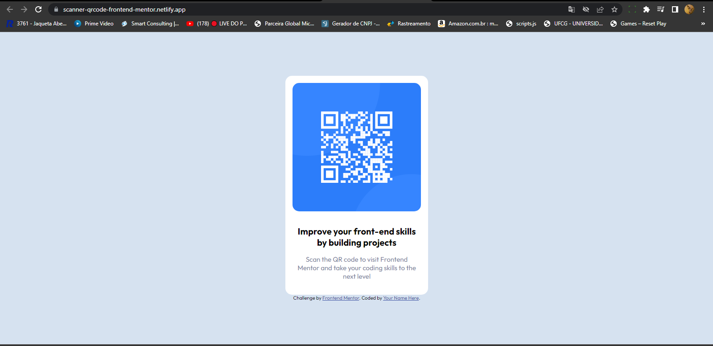

# primeiro-projeto-no-Frontend-Mentor
Solução usando HTML e CSS mobile-first

## Table of contents 
- [Overview](#overview)
  - [Screenshot](#screenshot)
  - [Links](#links)
 
 ## Overview
 
### Screenshot 

### Links

Solution  URL: [Add solution URL](https://scanner-qrcode-frontend-mentor.netlify.app/)
